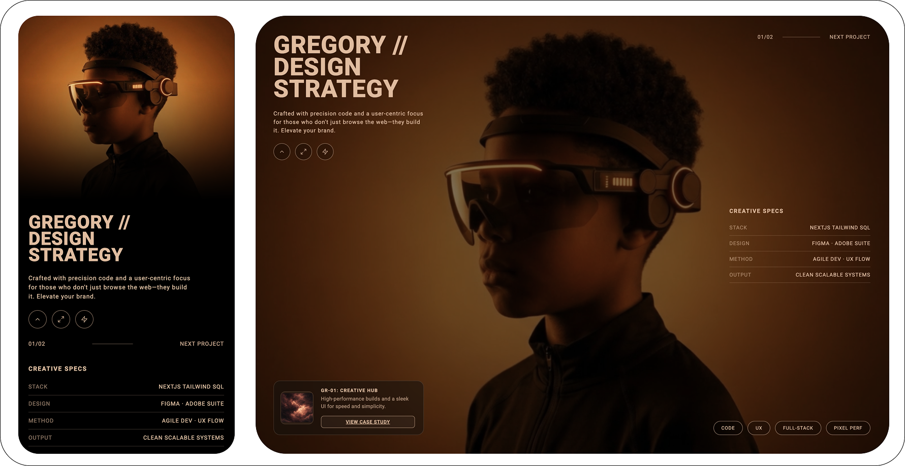
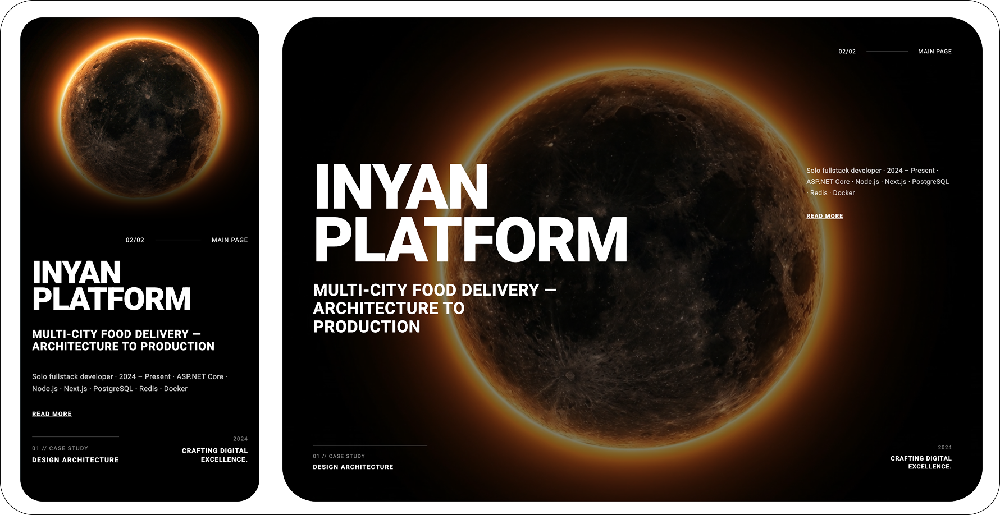

# Personal AI Portfolio

A cinematic, interactive portfolio website focused on premium visual presentation, smooth transitions, and a case-study style project showcase.

## Overview

This project is a minimalist front-end portfolio experience built with pure HTML, CSS, and JavaScript.
It combines:

- fullscreen video backgrounds,
- custom loading sequence and micro-interactions,
- page fade transitions,
- responsive layout adaptation for mobile and desktop.

The result is a clean, modern personal portfolio that feels more like a product experience than a static webpage.

## Live Structure

- `index.html` - main portfolio landing page
- `project.html` - project / case study page
- `public/` - static assets (for example thumbnail images)

## Highlights

- Immersive visual identity with fullscreen background video
- Animated intro loader with dynamic counter and word transitions
- Smooth page-to-page fade navigation
- Responsive mobile behavior with tailored layout and gradients
- Elegant UI details: glass card, icon buttons, compact tech-spec blocks

## Tech Stack

- HTML5
- CSS3 (custom properties, responsive media queries, transitions, animations)
- Vanilla JavaScript (DOM logic, animation flow, interaction handlers)

## Screenshots

> Add your mockups below (replace paths with your own files).

### Page 1



### Page 2



## Getting Started

1. Clone the repository:

```bash
git clone https://github.com/your-username/personal-ai-portfolio.git
cd personal-ai-portfolio
```

2. Run locally with any static server (example with Python):

```bash
python3 -m http.server 8080
```

3. Open:

```text
http://localhost:8080
```

## Customization

- Update personal text blocks in `index.html` and `project.html`
- Replace video source URLs with your own media assets
- Tune colors and style tokens via CSS variables in `:root`
- Add more project pages and connect them through navigation links

## Roadmap Ideas

- Add multilingual support
- Add dark/light theme toggle
- Introduce a reusable component structure
- Deploy with a CI workflow for automated publishing

## License

This project is available under the MIT License.  
Feel free to use it as a base for your own portfolio.
